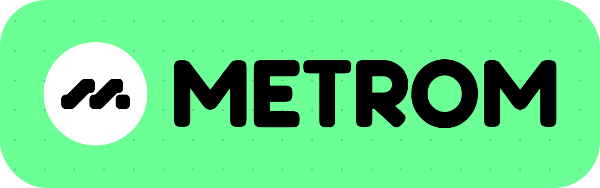

<br />

<p align="center">
    
</p>

<br />

<p align="center">
    Design your incentives to AMMplify liquidity.
</p>

<br />

<p align="center">
    
    
</p>

# Metrom docs

A documentation portal for the Metrom protocol built using Nextra with
Typescript.

More information on how to contribute will be added in a future
`CONTRIBUTING.md` file

## Getting Started

Start by installing the dependencies with `pnpm`:

```
pnpm i
```

An env variable is required to start the documentation portal and it determines
if the portal should run in dev mode or not. Create a `.env.local` file at the
root of the repo and add the `NEXT_PUBLIC_DEV` env. You can set it to either
true or false to determine how the portal will run.

Alternatively, just copy/paste and rename the `.env.example` file at the root of
the project to `.env.local` and give a value to the env variables there.

Once the env has been set up, you can start the dev server with:

```
pnpm dev
```

Open [http://localhost:3000](http://localhost:3000) with your browser to see the
result.

The app auto-updates as you edit the code.
